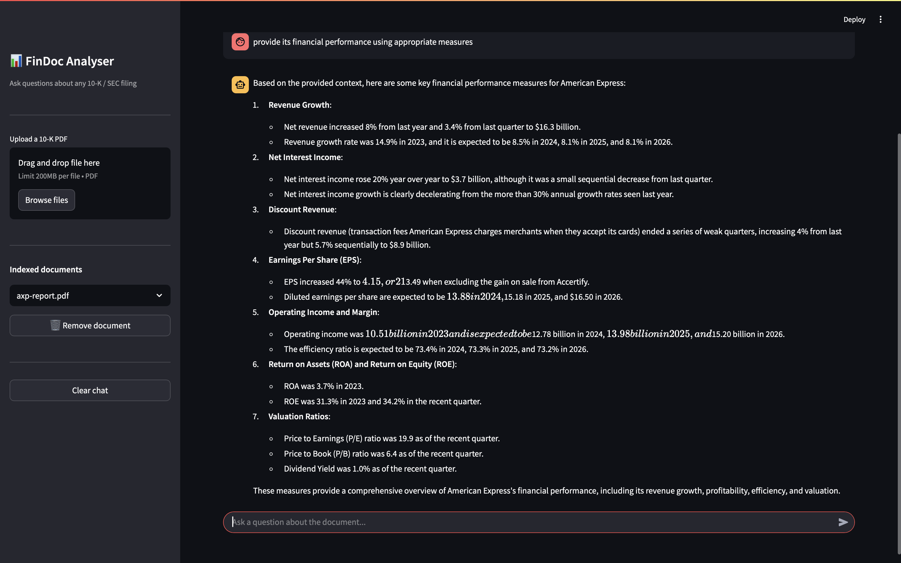

# FinDoc: Financial Document Analysis using AI

A RAG (Retrieval-Augmented Generation) pipeline for analyzing SEC 10-K financial documents using a local LLM. Ask questions about any uploaded financial document and get accurate, context-grounded answers — no API keys required.

---

## How It Works

```
User uploads PDF
      ↓
data_preprocessing.py  — extracts and cleans text (handles scanned pages via OCR)
      ↓
chunking.py            — splits text into paragraph-aware chunks with section labels
      ↓
storing_retrieval.py   — embeds and indexes chunks into ChromaDB

User asks a question
      ↓
question_generation.py — breaks query into 3 focused sub-questions (via groq llama3)
      ↓
storing_retrieval.py   — retrieves relevant chunks for each sub-question
      ↓
response_generation.py — generates final answer from retrieved context (via groq llama3)
      ↓
Answer returned to user
```

---

## Project Structure

```
findoc-analyser/
├── chromadb/                   # ChromaDB persistent storage
├── data/                       # Place your 10-K PDF files here
├── app.py                      # Streamlit UI
├── chunking.py                 # Paragraph-aware chunker with 10-K section detection
├── constants.py                # Model names, paths, config
├── data_preprocessing.py       # PDF extraction, OCR fallback, text cleaning
├── question_generation.py      # Sub-question decomposition via groq llama3
├── response_generation.py      # Answer generation via groq llama3
├── storing_retrieval.py        # ChromaDB indexing and retrieval
├── qna.py                      # Pipeline orchestrator
├── requirements.txt            # Python dependencies
└── README.md
```

---

## Installation


## Usage

**Start the app**
```bash
streamlit run app.py
```

1. Upload a 10-K PDF using the sidebar
2. Wait for it to be indexed (only happens once per document)
3. Type your question and get an answer

---

## Key Design Decisions

**Paragraph-aware chunking** — chunks are split on paragraph boundaries rather than fixed character counts, so retrieved passages are always coherent and readable.

**10-K section detection** — the chunker automatically labels chunks with their section (Risk Factors, MD&A, Financial Statements, etc.), which improves retrieval precision for section-specific queries.

**Sub-question decomposition** — broad queries like "how is the company performing?" are broken into focused sub-questions before retrieval, pulling more relevant chunks from different sections.

**Idempotent indexing** — re-uploading the same document does not create duplicate entries in ChromaDB.

**OCR fallback** — scanned or image-based PDF pages are automatically sent to Tesseract OCR so the pipeline works on older filings too.

---

## Roadmap

**Version 1 (current) — Qualitative Q&A**
- Upload any 10-K/SEC PDF
- Ask natural language questions
- RAG-grounded answers from the document

**Version 2 (planned) — Structured Financial Extraction**
- Extract key metrics: revenue, EPS, margins, debt ratios
- Year-over-year comparisons
- Risk flag detection
- Multi-document comparison across companies

---

## Demonstrations

**streamlit_v1.0**


## Contributors

- **Aditya Singh** — Architecture Design and Model Development
- **Dheeraj Yadav** — Integration, UI/UX and Deployment
